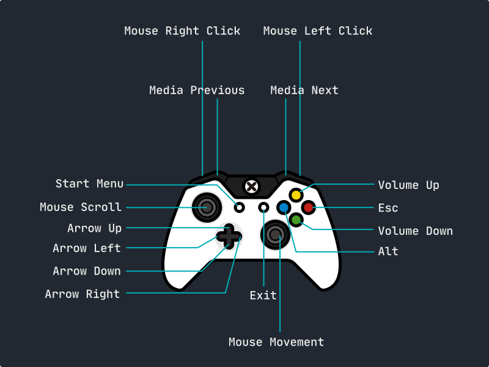

# ControllerX

Simulate basic mouse & keyboard input using an Xbox Controller.

---

### Platforms & Support

ControllerX currently supports 64-bit and 32-bit Windows Operation System.

---

### Demo

[ControllerX demo](https://www.youtube.com/watch?v=dQw4w9WgXcQ)

Just kidding `:)` here's the actual demo:

</img>

---

### How to use

You can build the project yourself or download one of the pre-built binaries.

- For instructions on how to build project, head to the [How to build](#how-to-build) section.

- For pre-built binaries, head to the [releases](https://github.com/ThaiDuongVu/ControllerX/releases) and download the latest one suitable for you system.

Once downloaded, extract and open executable file to start using!

---

### How to build

1. Clone repo using `git clone https://github.com/ThaiDuongVu/ControllerX.git`.
2. Open `ControllerX.sln` using Visual Studio.
3. Hit `Ctrl+B` to build project.
4. Hit `F5` to run project.

---

### Keymap

</img>

---

### Contribution

ControllerX is currently feature-complete but if you have any idea on how to improve the program, feel free to make a pull request.
